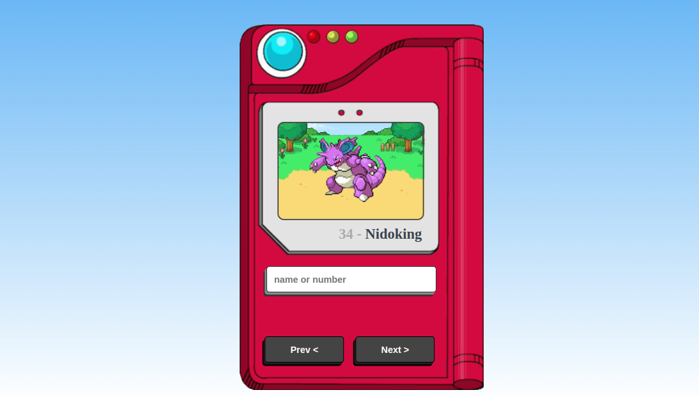

<h1 class = 'pokedex'> POKÉDEX &#128377</h1> 

> Desenvolvido com base na aula da Manual do Dev 

[Clique aqui para acessar]()

## 🌍 Tecnologias

- HTML
- CSS
- JAVASCRIPT

## 📚 Contato

Gmail : klayvemguik@gmail.com  
LinkedIn : https://www.linkedin.com/in/klayvem-guimar%C3%A3es-5a6700248/
